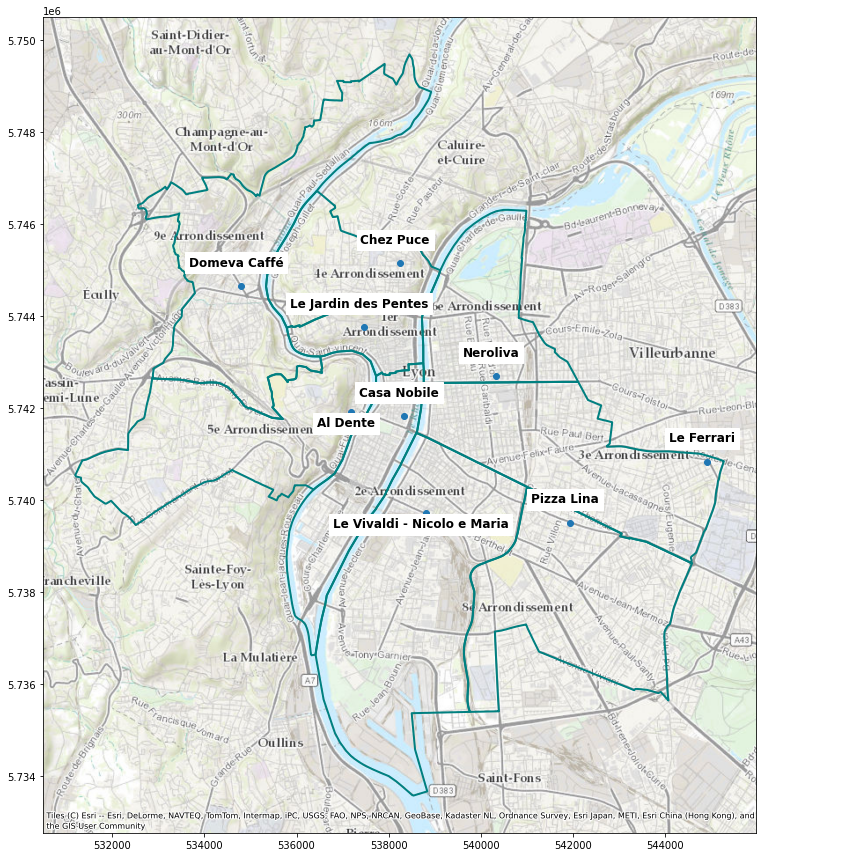

# pizza_analysis

A short data-science project in which I look for the best pizza in my hometown with python.
I gathered data regarding all restaurants in Lyon using the yelp API.
I then explore the restaurants price and ratings by district and category, before highlighting outstanding pizzerias in each distric using a linear model:

You can reproduce the analysis by running **Data_gathering.ipynb** and **Data_analysis.ipynb** with jupiter.
Alternatively, you can find a rendered version of these notebooks on my personal site:
 - [data gathering](https://c-saade.github.io/projects/yelp_api_gathering/)
 - [data analysis](https://c-saade.github.io/projects/yelp_api_analysis/)
